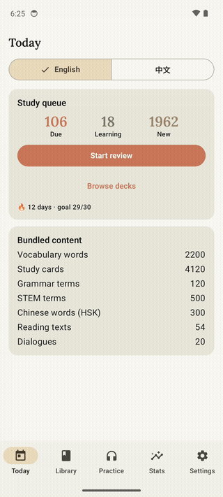
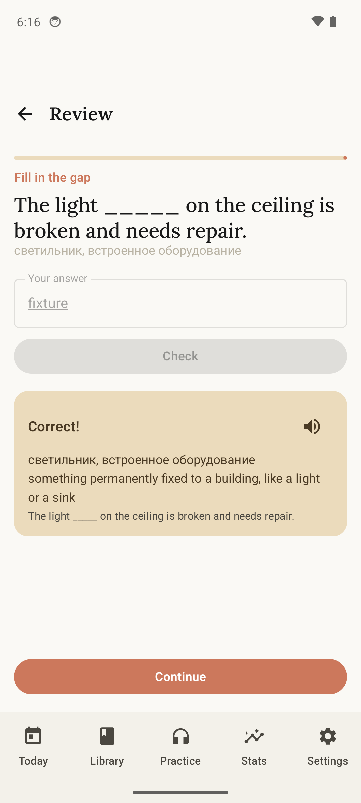
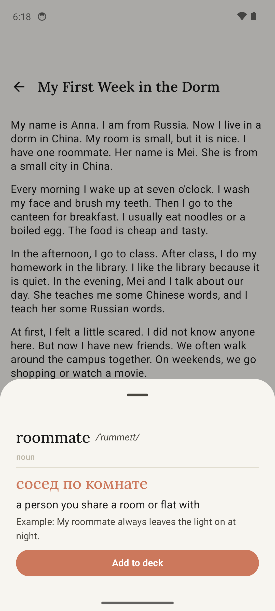
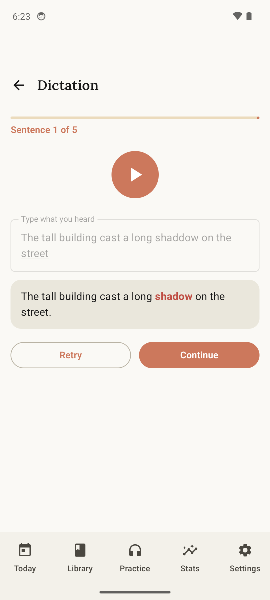
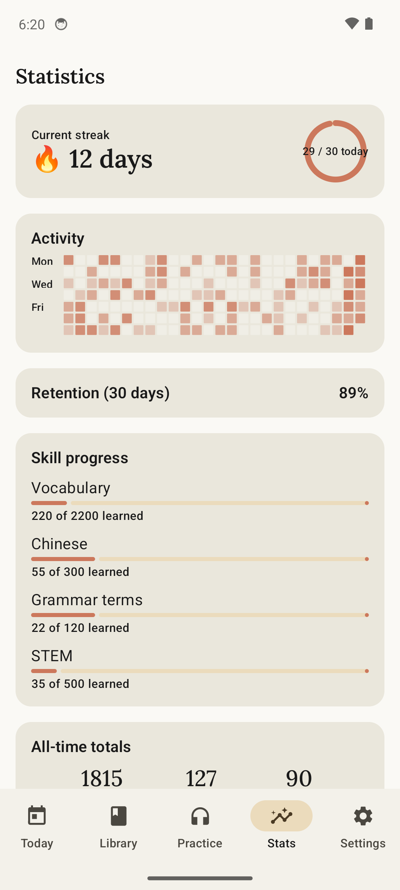

# LinguaBridge 🦉

**English** · [Русский](#linguabridge--по-русски)

[](https://github.com/Parker5717/LinguaBridge/releases/latest)

**Fully offline Android app for Russian speakers preparing for an English-taught
foundation year at a Chinese university.**

<p align="center"></p>

<table>
<tr>
<td align="center"><br><sub>SM-2 exercise + feedback</sub></td>
<td align="center"><br><sub>Tap-to-translate reader</sub></td>
<td align="center"><br><sub>Dictation with word diff</sub></td>
<td align="center"><br><sub>Streak & activity heatmap</sub></td>
</tr>
</table>

Built for one very specific journey: native Russian → studying STEM subjects *in
English* → learning Chinese *through English* — the exact situation of a student
entering a Foundation Program at a Chinese university (and later facing the CSCA
exam). Every screen, word list and exercise serves that path.

> 100% offline. Zero network permission in the manifest — nothing to track,
> nothing to leak, works in a dorm with no SIM card.

## Features

- **Duolingo-style spaced repetition** — SM-2 scheduler behind a swappable
  interface; each word climbs an exercise ladder: intro card → choose the
  translation → choose the word → type it → fill the gap in a real example →
  translate the whole sentence (RU → EN, word-level diff feedback). Auto-graded,
  typo-tolerant (Levenshtein ≤ 1).
- **Two study tracks** — English (via Russian) and Chinese HSK 1–2 (via English,
  simulating real classes), switchable on the home screen.
- **4,120 study cards, all bundled**: 2,200 English words (A2→B2) with IPA,
  definitions and translated examples · 500 STEM terms (math + physics) with
  CSCA-style example problems · 120 grammar-metalanguage terms Chinese teachers
  use when teaching through English · 300 HSK words + 40 grammar points.
- **Library** — 45 graded texts (A2/B1/B2, campus life in China, accessible STEM)
  with tap-any-word translation popups, and 20 dialogues (classroom, dorm, clinic,
  DiDi) with per-line TTS, pinyin and Russian notes.
- **Listening** — TTS dictation with word-level diff highlighting, and
  listening-comprehension passages with questions (15 passages).
- **240 quiz questions** across 8 categories, a placement test, and a CSCA mode
  where the challenge is decoding the English wording of math/physics problems.
- **Offline dictionary** — instant search across all four content tables, in any
  direction (English, Russian, hanzi, pinyin).
- **Word game** — Wordle on the app's own vocabulary; solving a puzzle teaches
  you the word.
- **Progress** — streaks, GitHub-style activity heatmap, 30-day retention,
  per-skill progress; word-of-the-moment notifications (AlarmManager, survives
  Doze); full RU/EN interface switch; warm paper-and-clay theme (light + dark)
  with Lora serif display type.

## Architecture

Single-module Kotlin app: Jetpack Compose + Material 3, MVVM with manual DI
(one `AppContainer`, no Hilt), Room, DataStore, platform TextToSpeech.

The interesting part is the **content pipeline**:

```
content/*.json  ──validate──▶  tools/pack_content.py  ──▶  app/src/main/assets/content.db
   (source of truth,             JSON Schema + cross-file        (prepackaged Room DB)
    human-readable)              checks: duplicate ids/words,
                                 pinyin tone marks, MCQ answers,
                                 passage refs, dialogue order
```

- Two Room databases: `content.db` (read-only, shipped via `createFromAsset`,
  regenerated freely) and `user.db` (on-device progress) — content updates never
  touch your learning history.
- The packer builds `content.db` **from Room's exported schema JSON**
  (`app/schemas/`), so the Kotlin entities are the single source of truth and the
  asset can never drift from the code.
- The packer and the SM-2 scheduler are both covered by tests
  (`tools/tests/`, `app/src/test/`).

## Building

Requirements: JDK 17, Android SDK (platform 35), Python 3.10+ with `jsonschema`.

```bash
# 1. Pack the content database (validates all JSON first)
python tools/pack_content.py

# 2. Build the APK
./gradlew assembleDebug          # Windows: .\gradlew.bat assembleDebug

# Tests
./gradlew test
python -m pytest tools/tests/test_pack.py -q
```

The APK lands in `app/build/outputs/apk/debug/`. min SDK 29, target SDK 35.

## Content

All learning content was generated with Claude (Anthropic) in validated batches —
every batch passes JSON Schema plus cross-file consistency checks before it can
be packed (malformed batches are regenerated, never hand-patched). Russian
translations are natural Russian; all pinyin carries tone marks; polyphones
(多音字) are handled as distinct vocabulary items.

## License

Code: [MIT](LICENSE). Bundled Lora font: SIL OFL 1.1 (see [LICENSES.md](LICENSES.md)).

---

# LinguaBridge 🦉 (по-русски)

[English](#linguabridge-) · **Русский**

[](https://github.com/Parker5717/LinguaBridge/releases/latest)

**Полностью офлайн Android-приложение для русскоязычных студентов, готовящихся
к учёбе на англоязычной foundation-программе в китайском университете.**

<p align="center"></p>

<table>
<tr>
<td align="center"><br><sub>Упражнение SM-2 + обратная связь</sub></td>
<td align="center"><br><sub>Читалка с тап-переводом</sub></td>
<td align="center"><br><sub>Диктант с подсветкой ошибок</sub></td>
<td align="center"><br><sub>Стрик и тепловая карта</sub></td>
</tr>
</table>

Сделано под один конкретный путь: родной русский → изучение STEM-предметов *на
английском* → изучение китайского *через английский* — ровно та ситуация, в
которой оказывается студент подготовительной программы китайского вуза (а позже
— экзамена CSCA). Каждый экран, список слов и упражнение служат этому пути.

> 100% офлайн. В манифесте нет сетевого разрешения — нечему следить, нечему
> утекать, работает в общежитии без SIM-карты.

## Возможности

- **Интервальное повторение в стиле Duolingo** — планировщик SM-2 за заменяемым
  интерфейсом; каждое слово поднимается по лестнице упражнений: карточка-знакомство
  → выбери перевод → выбери слово → напиши его → вставь в пропуск в реальном
  примере → переведи предложение целиком (RU → EN, пословная проверка).
  Автооценка, терпимость к опечаткам (Левенштейн ≤ 1).
- **Два трека изучения** — английский (через русский) и китайский HSK 1–2
  (через английский, как на реальных занятиях), переключение на главном экране.
- **4 120 карточек, всё встроено**: 2 200 английских слов (A2→B2) с транскрипцией,
  определениями и переведёнными примерами · 500 STEM-терминов (математика +
  физика) с примерами задач в стиле CSCA · 120 грамматических терминов, которыми
  китайские преподаватели оперируют, уча через английский · 300 слов HSK +
  40 грамматических тем.
- **Библиотека** — 45 текстов по уровням (A2/B1/B2: жизнь кампуса в Китае,
  доступный STEM) с переводом любого слова по нажатию, и 20 диалогов (аудитория,
  общежитие, клиника, DiDi) с озвучкой каждой реплики, пиньинем и русскими
  заметками.
- **Аудирование** — диктанты с озвучкой и пословной подсветкой ошибок, а также
  отрывки на понимание с вопросами (15 отрывков).
- **240 вопросов викторин** в 8 категориях, тест на уровень и режим CSCA, где
  сложность — понять английскую формулировку задачи по математике или физике.
- **Офлайн-словарь** — мгновенный поиск по всем четырём таблицам контента в любую
  сторону (английский, русский, иероглифы, пиньинь).
- **Игра в слова** — Wordle на словаре приложения; решая головоломку, учишь слово.
- **Прогресс** — стрики, тепловая карта активности в стиле GitHub, удержание за
  30 дней, прогресс по навыкам; уведомления «слово дня» (AlarmManager, переживает
  режим дрёмы); полное переключение интерфейса RU/EN; тёплая «бумажная» тема
  (светлая + тёмная) с серифным шрифтом Lora.

## Архитектура

Одномодульное Kotlin-приложение: Jetpack Compose + Material 3, MVVM с ручным DI
(один `AppContainer`, без Hilt), Room, DataStore, системный TextToSpeech.

Самое интересное — **контент-пайплайн**:

```
content/*.json  ──валидация──▶  tools/pack_content.py  ──▶  app/src/main/assets/content.db
   (источник истины,              JSON Schema + сквозные          (предсобранная база Room)
    читаемый человеком)           проверки: дубли id/слов,
                                  тоновые знаки пиньиня, ответы
                                  MCQ, ссылки на отрывки,
                                  порядок реплик диалогов
```

- Две базы Room: `content.db` (только чтение, поставляется через
  `createFromAsset`, свободно пересобирается) и `user.db` (прогресс на
  устройстве) — обновления контента никогда не трогают историю обучения.
- Пакер собирает `content.db` **из экспортированной Room схемы JSON**
  (`app/schemas/`), поэтому Kotlin-сущности — единственный источник истины, и
  ассет не может разойтись с кодом.
- Пакер и планировщик SM-2 покрыты тестами (`tools/tests/`, `app/src/test/`).

## Сборка

Требования: JDK 17, Android SDK (платформа 35), Python 3.10+ с `jsonschema`.

```bash
# 1. Собрать базу контента (сначала валидирует весь JSON)
python tools/pack_content.py

# 2. Собрать APK
./gradlew assembleDebug          # Windows: .\gradlew.bat assembleDebug

# Тесты
./gradlew test
python -m pytest tools/tests/test_pack.py -q
```

APK появится в `app/build/outputs/apk/debug/`. min SDK 29, target SDK 35.

## Контент

Весь учебный контент сгенерирован с помощью Claude (Anthropic) валидируемыми
батчами — каждый батч проходит JSON Schema и сквозные проверки согласованности,
прежде чем попасть в базу (некорректные батчи перегенерируются, а не правятся
вручную). Русские переводы — естественный русский; весь пиньинь с тоновыми
знаками; многозначные иероглифы (多音字) обрабатываются как отдельные слова.

## Лицензия

Код: [MIT](LICENSE). Встроенный шрифт Lora: SIL OFL 1.1 (см. [LICENSES.md](LICENSES.md)).
